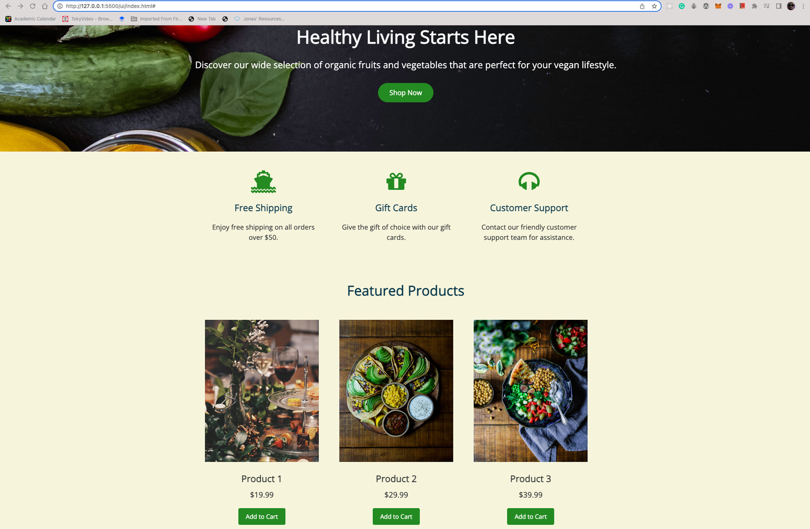

<p align="center">
  
</p>

# E-commerce Landing Page with Golang and ButterCMS
This project is a tutorial that shows how to create an e-commerce landing page using Golang and ButterCMS. ButterCMS is an API-based content management system that makes it simple to integrate with front-ends created by developers.

The tutorial covers the following topics:

- Setting up a Golang development environment
- Creating a ButterCMS account and integrating it with Golang
- Building an e-commerce landing page using Golang templates and ButterCMS data

## Prerequisites
Before following the tutorial, you should have the following:

- A basic understanding of Golang programming language and web development concepts
- A ButterCMS account
- Golang installed on your local machine
- A code editor or IDE of your choice

# Getting Started
To get started with the tutorial, follow these steps:

1. Clone the repository:
```sh
git clone https://github.com/ButterCMS/ecommerce-landing-page.git
```
2. Install the required Golang packages:
```bash
go get github.com/buttercms/buttercms-go
go get github.com/bmizerany/pat
```
3. Create a ButterCMS account and obtain your API keys.

4. Set your ButterCMS API keys as environment variables:

```sh
export BUTTERCMS_API_TOKEN=<your_api_token>
```
5. Run the application:
```sh
go run server/cmd/*
```
The application should now be running on http://localhost:8080/landing-page.

## Tutorial
The tutorial is broken down into several steps, which are explained in detail in the [tutorial](https://buttercms.com/blog/golang-landing-page-tutorial/) section of the project.

## Conclusion
By following this tutorial, you should have learned how to create an e-commerce landing page using Golang and ButterCMS. With Golang and ButterCMS, you can create fast and responsive web applications with ease.